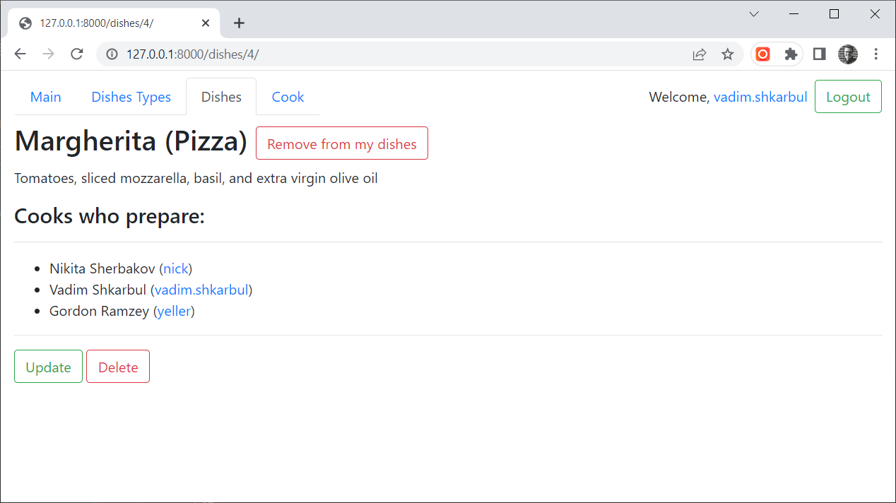

# Kitchen management system (KMS)

### Part of restaurant management system which helps distribute the dishes preparation between cooks

# Check it out

### [-> KMS project deployed to Render <-](https://restaurant-management-system.onrender.com/main/)

```shell
login: admin.user
password: 123admin123
```

# Installation

### [Python 3](https://www.python.org/downloads/) must be already installed

```shell
git clone https://github.com/VadymShkarbul/restaurant_managment_service.git
cd restaurant_managment_service
python3 -m venv venv
source venv/bin/activate
pip install -r requerements.txt
python manage.py migrate
python manage.py runserver
```

## Features

* Authentication functionality for Cook/User
* Managing dishes and dishes types directly from website
* Powerful admin panel for advanced managing

## Demo

